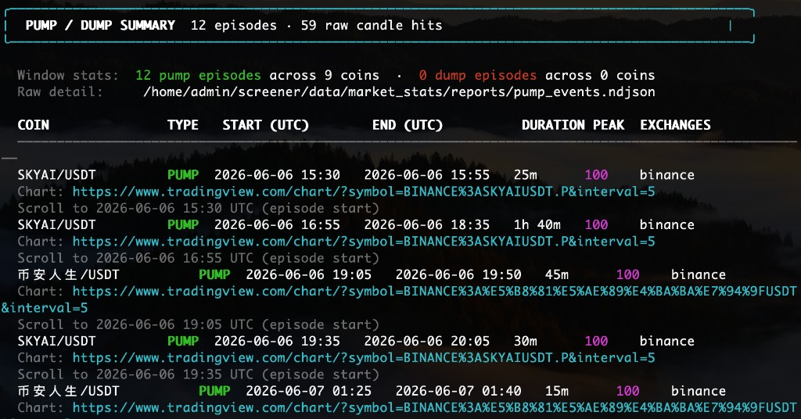
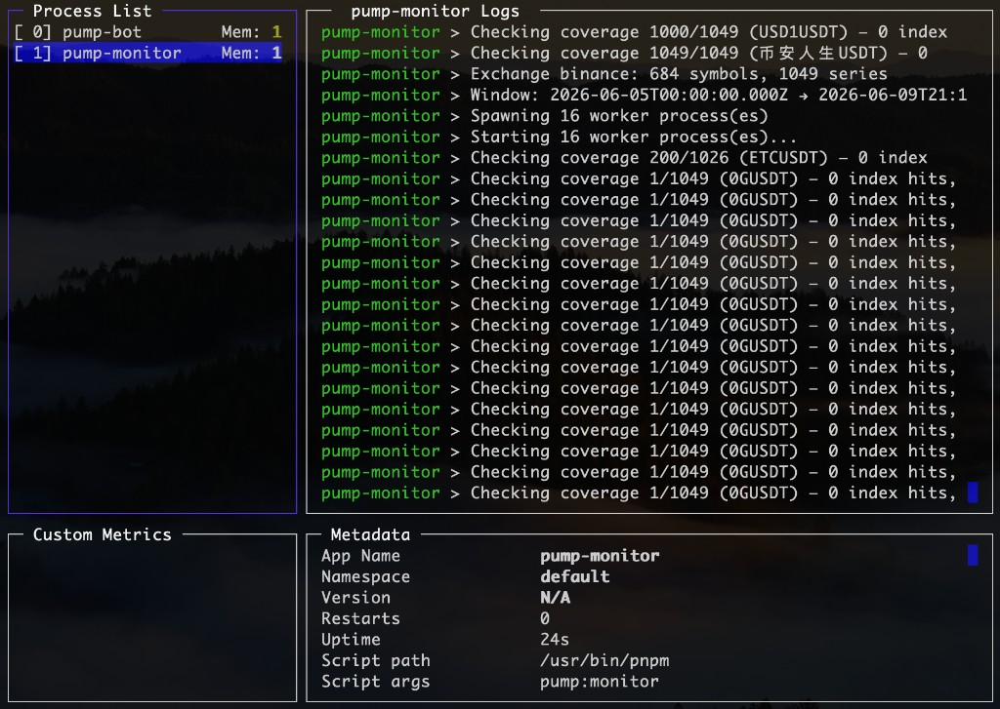
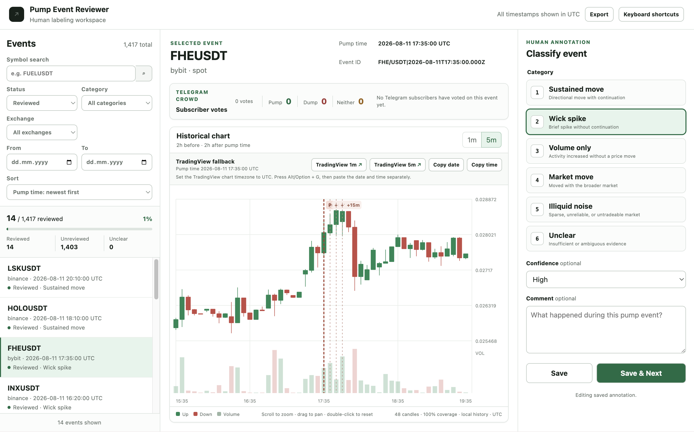
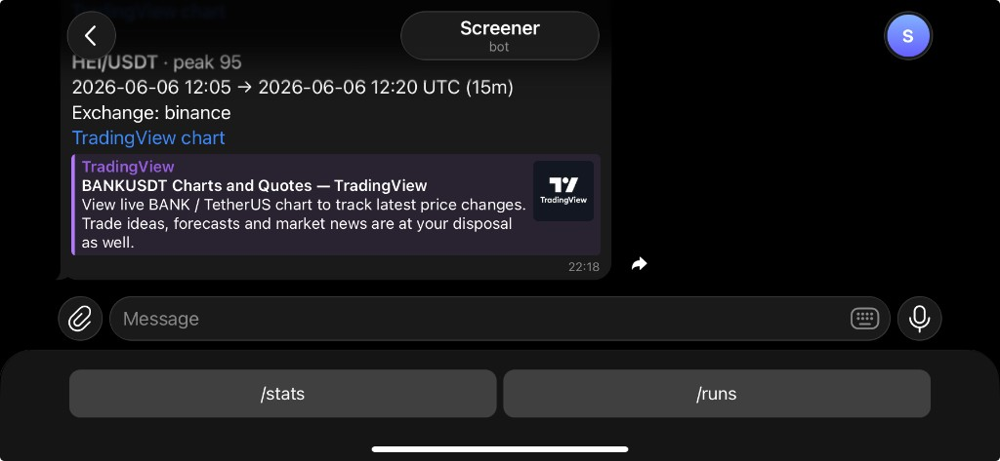

# Pump and Dump Crypto Screener

<p align="center">
  
</p>

TypeScript pnpm monorepo for pulling 1m/5m market statistics and bulk kline archives from Binance and Bybit, detecting pump/dump regimes, and alerting via Telegram.

**Try the live bot:** [Open @pumpdumpscreenerautobot on Telegram](https://t.me/pumpdumpscreenerautobot)

**Requirements:** Node.js 20+, pnpm 9+, [pm2](https://pm2.keymetrics.io/) (process manager for production).

## How to set up

**No exchange API keys.** Binance and Bybit data comes from public bulk archives and public REST endpoints.

You need two free accounts (~2 minutes each):

| Service | Why | Setup |
|---------|-----|--------|
| **[Turso](https://turso.tech)** | Stores pumps, monitor runs, and Telegram subscribers | [Turso CLI](https://docs.turso.tech/cli): `turso db create screener` → copy URL + auth token into `config.js` |
| **Telegram** | Pump alerts and `/stats` / `/runs` / `/about` bot | [@BotFather](https://t.me/BotFather) → `/newbot` → see [docs/telegram_setup.md](docs/telegram_setup.md) |

### 1. Install dependencies and configure

```bash
pnpm install
cp config.example.js config.js   # fill in Turso + Telegram (see table above)
```

Edit `config.js` — at minimum, configure `database`, `telegramBotToken`, and your private `classifierTelegramChatId`. Optionally set `publicTelegramChatId` for an always-on public group or channel feed without voting controls. The bot discovers that destination's discussion link; `publicTelegramChatUrl` can override it with an explicit `https://t.me/...` username or invite URL. Anyone who sends `/start` is automatically subscribed to alerts and can use `/stats`, `/runs`, and `/about`; only the classifier chat syncs votes to the legacy classification field. Pump lookback and scan settings live under `pump` (defaults in [`config.example.js`](config.example.js)):

```javascript
database: {
  url: "libsql://screener-....turso.io",
  authToken: "...",
},
telegramBotToken: "123456789:ABC...",
classifierTelegramChatId: "36772199",
publicTelegramChatId: "-1001234567890", // optional read-only group/channel
publicTelegramChatUrl: "https://t.me/example_chat", // optional link override
web: {
  port: 3000,    // local app server; nginx terminates public HTTP/HTTPS
  host: "127.0.0.1",
},
pump: {
  days: 5,        // lookback calendar days for download + scan
  minScore: 80,
  scanCache: true,
  requireCalmPrePump: false, // feature flag: require a calm 2h period before pumps
},
```

### 2. Build and init the database

```bash
pnpm build
pnpm db:bootstrap
```

Run `pnpm build` again after every code change — PM2 does not rebuild for you.

### 3. Start with PM2

Production runs are defined in [`ecosystem.config.cjs`](ecosystem.config.cjs) at the repo root. It starts three processes:

| PM2 name | What it runs | Role |
|----------|--------------|------|
| `pump-monitor` | `pnpm pump:monitor` | Download → scan → persist pumps → Telegram alerts |
| `pump-bot` | `pnpm pump:bot` | `/stats`, `/runs`, `/about`, and **Pump \| Dump \| None** button clicks |
| `pump-web` | `pnpm pump:web` | Plain HTTP page showing the last 10 stored pumps |

```bash
pm2 start ecosystem.config.cjs
```

<p align="center">
  
</p>

PM2 keeps all processes alive. When `pump-monitor` finishes a pipeline run it exits; PM2 immediately starts the next run (`autorestart: true`). That replaces a manual cron loop.

**First run** downloads `pump.days` of candles into `data/market_stats/` — network + disk required; can take hours. Market data is not in the repository.

The web page is served by `pump-web` on `127.0.0.1:3000` by default. Put nginx in front of it for public HTTP/HTTPS; see [docs/nginx_letsencrypt.md](docs/nginx_letsencrypt.md).

Persist PM2 across reboots:

```bash
pm2 save
pm2 startup   # follow the printed command (once per server)
```

## Pump Event Reviewer

<p align="center">
  
</p>

The manual reviewer at `/review` turns detected pumps into a human-labeled dataset for
evaluating and improving the screener. It is designed for a fast, keyboard-friendly
workflow:

- Browse and filter stored pump events by status, category, exchange, symbol, and date.
- Inspect Telegram subscriber votes alongside a 1m or 5m OHLCV chart centered on the
  screener's detection time. Charts use local history when available and otherwise load
  the four-hour window from the event's public Binance or Bybit API.
- Classify each event as a wick spike, weak pump, sustained move, volume only,
  illiquid noise, or unclear; optionally record confidence and a comment.
- Save and advance with keyboard shortcuts, revisit existing labels, track review
  progress, and export labeled datasets as JSON or CSV.

Human annotations are stored separately from the original pump records, so review does
not modify detector output. The workspace uses the existing Turso database, makes no
browser-to-exchange requests, and can be protected with simple HTTP Basic authentication.
See the [pump review operator guide](docs/pump-event-review/implementation.md) for setup,
access control, deployment, and release checks.

## PM2 day-to-day

```bash
pm2 status
pm2 logs                          # all apps
pm2 logs pump-monitor             # download + scan pipeline
pm2 logs pump-bot                 # Telegram bot
pm2 logs pump-web                 # HTTP page

pm2 restart ecosystem.config.cjs  # after config.js or code changes (rebuild first)
pm2 restart pump-monitor          # restart pipeline only
pm2 restart pump-bot              # restart bot only
pm2 restart pump-web              # restart HTTP page only

pm2 stop ecosystem.config.cjs
pm2 delete ecosystem.config.cjs
```

After editing `config.js`, restart the affected process (`pm2 restart pump-monitor`, `pump-bot`, or `pump-web`). No PM2 reload is needed for config-only changes if you restart.

**Classification buttons** need `pump-bot` running — it is included in `ecosystem.config.cjs`, not optional in production.

## What `pump-monitor` does

Each PM2-driven run is an end-to-end pipeline:

1. **Download** — last `pump.days` of 1m/5m candles from **Binance and Bybit** (archives + REST fallback). See [docs/fetch_all.md](docs/fetch_all.md).
2. **Scan** — pump/dump detection; output `data/market_stats/reports/pump_events.ndjson`.
3. **Persist + alert** — upsert pump episodes to Turso; Telegram message per **new, current** pump (`coin|pump_start_utc`). Episodes ending before the previous successful monitor cycle began are historical backfill: they are stored for `/review` but are not broadcast as fresh alerts.

The exchange symbol universe is re-discovered when
`data/market_stats/reports/symbol_universe.json` reaches
`pump.universeRefreshDays` old (default: 4 days). This adds new listings and removes
delisted instruments from subsequent fetches and scans.

On disk: `data/market_stats/` (`archives/`, `api_fallback/raw/`, `reports/`). Cached series are skipped on repeat runs. Nothing is ever pruned automatically — see [Disk usage and retention](#disk-usage-and-retention).

Subscriber and classifier alerts have **Pump | Dump | None** voting buttons and a link to the configured public discussion chat. The classifier chat's vote also updates `pumps.classification`. A configured `publicTelegramChatId` receives the same alert without buttons or the redundant self-link; when votes arrive elsewhere, its message is updated with the aggregate totals while remaining read-only.

<p align="center">
  
</p>

Turso bootstrap (one-time):

```bash
turso db create screener
turso db show screener --url
turso db tokens create screener
pnpm db:bootstrap
```

Telegram details: [docs/telegram_setup.md](docs/telegram_setup.md).

### Scan cache

Per-coin results under `data/market_stats/reports/scan_cache/` (override with `--cache-dir` on the underlying CLI). Entries are reused when detector version, scan params, window start, and loaded candle identity per exchange are unchanged — not file mtimes. New 5m bars trigger an **incremental tail rescan** (~400 bars); UTC midnight window rolls trigger a full rescan.

Disable cache: set `pump.scanCache: false` in `config.js`, or delete `scan_cache/`, then `pm2 restart pump-monitor`.

Scanning uses a **worker thread pool** (auto-detected CPU cores). Production scan step uses compiled `dist/cli.js` with native worker threads (required on Linux/VDS).

### Disk usage and retention

Nothing in the pipeline deletes anything — every run only appends. On a long-lived VDS `data/market_stats/` grows without bound (100 GB+ over a couple of months is normal).

| Path | What it holds | Grows with | Read back? |
|------|---------------|------------|------------|
| `archives/` | Binance bulk archive downloads, `symbol=X/date=YYYY-MM-DD` | days × symbols | yes |
| `api_fallback/raw/` | REST fallback candles, `date=YYYY-MM-DD/symbol=X` | days × symbols | yes |
| `extracted/` | archives unpacked to NDJSON, `date=YYYY-MM-DD/symbol=X` | days × symbols | yes — derived, regenerable from `archives/` |
| `reports/pump_detector/<runId>/` | orchestrator log + two files per coin | **every run** (~50 MB each) | no |
| `reports/scan_cache/` | per-coin scan results | symbol count only (~6 MB) | yes |

`reports/pump_detector/` is usually the bulk of it. A fresh run directory is created on every scan, and PM2 restarts `pump-monitor` the moment it exits, so this is several GB/day of debug output that no code path reads.

Scanning itself only needs `pump.days` of candles. Longer retention exists for the `/review` UI, which reads `archives/`, `api_fallback/`, and `extracted/` to draw charts for past episodes — below the retention horizon those charts fall back to TradingView, while stored pump rows remain available until the database retention cutoff.

[`scripts/prune-market-data.sh`](scripts/prune-market-data.sh) prunes both by age. It is dry-run by default:

```bash
./scripts/prune-market-data.sh            # preview: matched directories and size
./scripts/prune-market-data.sh --apply    # delete
```

Defaults keep 60 days of candles and 2 days of run directories; override with `RETAIN_DAYS`, `RUN_RETAIN_DAYS`, `DATA_DIR`. Safe to run while `pump-monitor` is live — the run-directory floor keeps the in-flight run, and the pipeline only writes today's date partitions.

Keep it from coming back with a daily cron:

```bash
(crontab -l 2>/dev/null; echo "17 4 * * * cd /path/to/repo && ./scripts/prune-market-data.sh --apply >> /tmp/prune-market-data.log 2>&1") | crontab -
```

#### Database event retention

The production retention policy keeps **365 days** of pump/dump events in Turso. Rows
whose `pumps.start_ms` is older than the cutoff are deleted together with their
`pump_annotations`, Telegram votes, and Telegram message references. Export any
reviewed labels that must be kept longer from `/review` and take a database backup
before applying the prune.

The database command is also dry-run by default and reads the same Turso credentials
as the other database commands:

```bash
pnpm db:prune-pumps                                      # preview the default 365-day cutoff
PUMP_RETAIN_DAYS=180 pnpm db:prune-pumps                 # preview a custom cutoff
PUMP_RETAIN_DAYS=365 pnpm db:prune-pumps -- --apply      # delete in one transaction
```

Run the preview after every deployment. Once its counts are understood and the backup
policy is in place, schedule the apply command weekly:

```bash
(crontab -l 2>/dev/null; echo "47 4 * * 0 cd /path/to/repo && PUMP_RETAIN_DAYS=365 pnpm db:prune-pumps -- --apply >> /tmp/prune-pumps.log 2>&1") | crontab -
```

The pruning command applies the current schema before inspecting rows, so existing
databases also receive the case-insensitive `leading_exchange` filter index. Run
`pnpm db:bootstrap` independently during normal deployments so migration failures are
visible before the web process is restarted.

PM2's own logs accumulate separately from `data/`. Check with `du -sh ~/.pm2/logs`; `pm2 flush` clears them and `pm2 install pm2-logrotate` prevents recurrence.

### One-off CLI flags

The pipeline CLIs accept flags if you need a single manual run (debugging only):

```bash
pnpm pump:monitor -- --no-telegram --cache-dir /path/to/cache
```

Normal operation should stay on PM2.

## Diagnostics

**Local cache coverage** — how complete on-disk data is for the lookback window:

```bash
pnpm report:coverage
pnpm report:coverage -- --exchanges binance --days 7
pnpm report:coverage -- --start 2026-06-03T00:00:00Z --end 2026-06-04T00:00:00Z --json
```

Example output:

```
Window: 2026-06-03 → 2026-06-04 (1 days), intervals 5m
For all coins present on exchange: Binance 82.9% cached (1133/1367), Bybit 80.0% cached (...)
```

Useful flags: `--days`, `--exchanges`, `--quote-currencies`, `--discover`, `--json`.

## Workspace layout

- `ecosystem.config.cjs` — PM2 process definitions (`pump-monitor`, `pump-bot`, `pump-web`)
- `config.js` — Turso, Telegram bot token, `pump.*`, `fetch.intervals` (copy from `config.example.js`)
- `scripts/prune-market-data.sh` — age-based cleanup for `data/market_stats/`
- `pnpm db:prune-pumps` — dry-run-first retention cleanup for Turso pump events
- `packages/core` — HTTP client, config, pull window
- `packages/exchanges` — exchange adapters
- `packages/storage` — NDJSON, gaps, manifest I/O
- `packages/universe` — symbol universe and task resolution
- `packages/archive` — archive planners and download runner
- `apps/fetch-market-archives` — universe archive pull CLI (+ coverage reports)
- `packages/db` — screener database (Turso/libSQL)
- `packages/pump-detector` — pump regime detection ([PUMP_DETECTION_RULES.md](PUMP_DETECTION_RULES.md))
- `apps/run-pump-detector` — scan worker pool and `pump_events.ndjson`
- `apps/pump-monitor` — fetch + scan + Turso + Telegram alerts + HTTP pump page
- `apps/fetch-market-stats` — REST candle pull CLI (standalone; not used by `pump-monitor`)

## License

This project is open source under the [MIT License](LICENSE).
